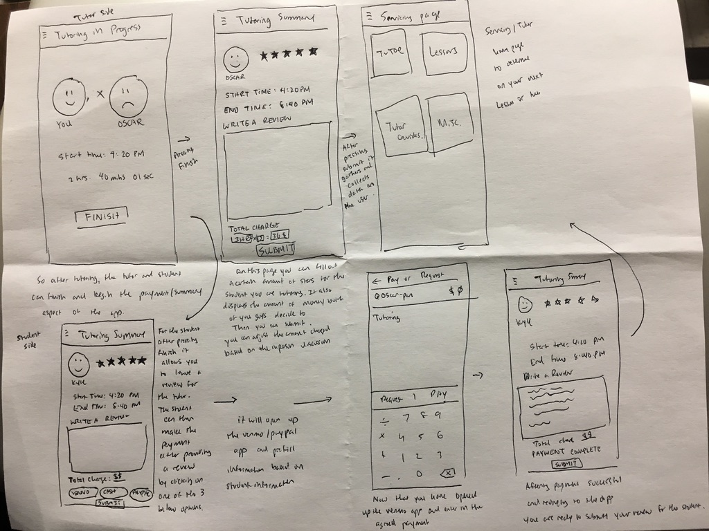

### David's Prototype

### Maxim's Prototype

For my paper prototype2 I did one aspect of the app which was payment/summary for both the tutor and the student. So the tutor basically goes through the screens to decide how much to charge and can leave his review for the student and determing the rating for him. THe student also confirms and agrees on the price and we utilize venmo/paypal's api to redirect to their application for payment and after payment, the student can click and submit their review for the tutor.
