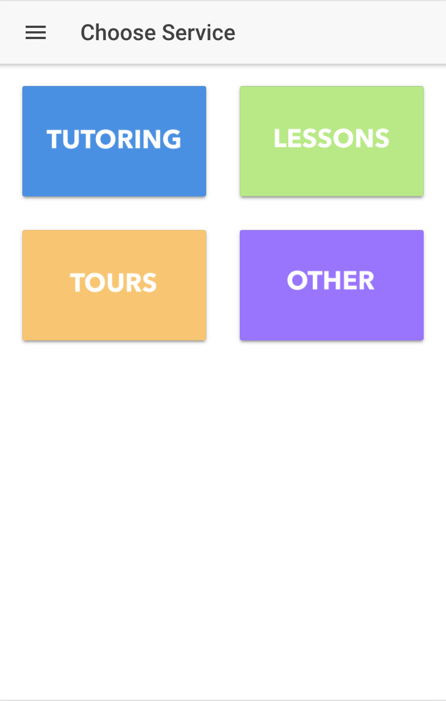
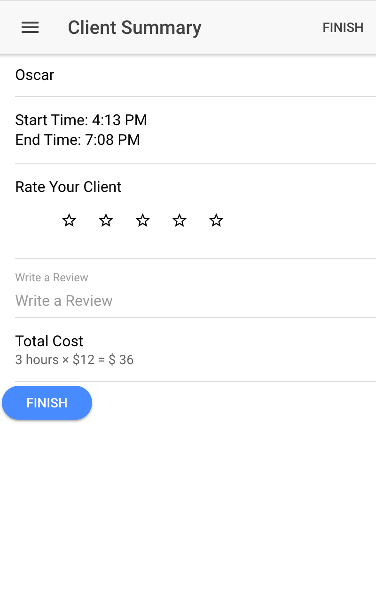
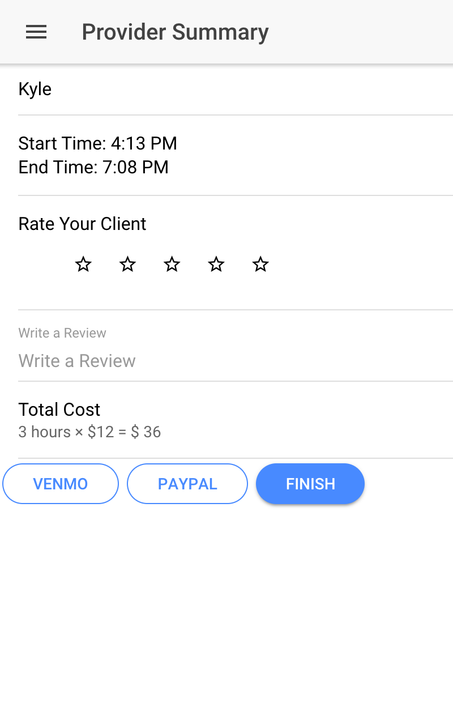
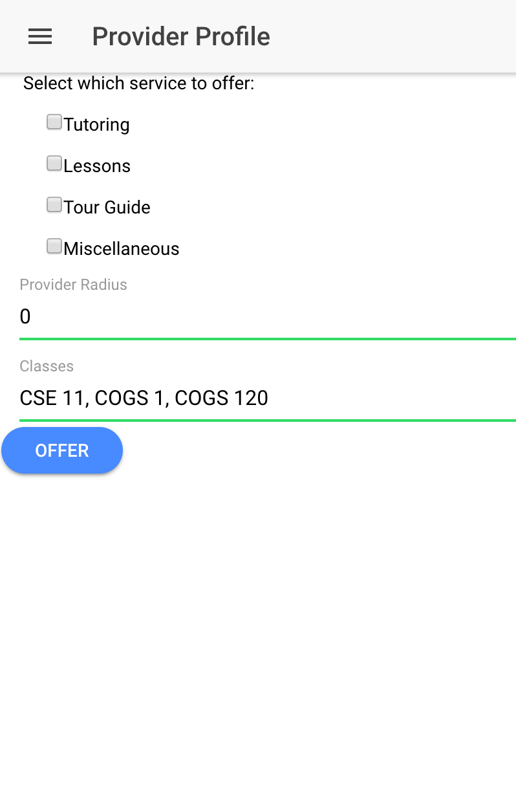

### Changes since last time

- Application now working on native iPhone
- Fixed UI issues
- UI consistency
- Workflow for application

#### Choose services

#### Client Summary

#### Provider Summary

#### Provider Profile

#### Roles:
- Oscar Pan: Worked on the workflow of the application and UI for all pages
- David Zech: Worked on making the application work on the native iPhone
- Max Chen:  Worked on the UI and issues for account settings page
- Joey Wong: Worked on minor UI for the checkboxes and button consistency
