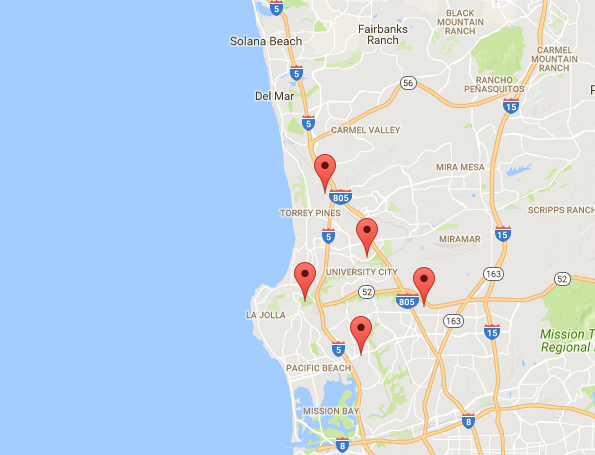

# Testing implementations of 2 frameworks
We have two separate implementations to test mapping and we're going to be integrating them together in future milestones.

## Meteor + Google Maps (JS)
  
This is just a proof of concept with the mapping, by double clicking on a place on the map, you are able to put down a create a marker. By dragging and dropping existing markers, you are able to move them. This is all synced via a Meteor collection of Markers so that if multiple people have the map open, any changes by one person will be reflected on the other person's map as well. Basically, it's like a collaborative google doc. This is going to be our baseline for implementing how Markers move according to the user's current location while they're offering tutor services and waiting for someone to request them.

## Ionic + Google Maps (Native Bridge w/ Cordova)
