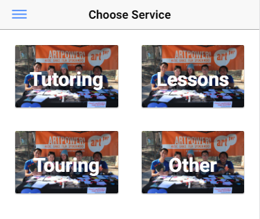
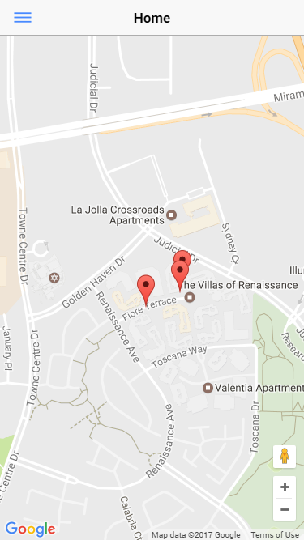
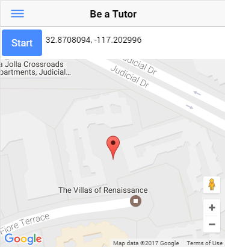
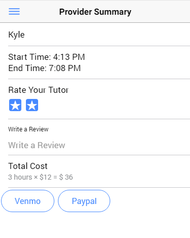
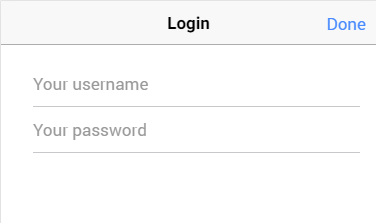

### Changes since last time

- Merged Ionic and Meteor Frameworks
- Moved to JS Google Map instead of relying on Native (iOS, Android) Google Maps
- Basic realtime backend syncing - markers are added in realtime to all clients when backend receives it
- Created basic pages for core functionalities of app (summary pages, overview pages)
- Basic login -- this will get integrated with the marker locations to provide realtime updates

#### Selecting Your Service Page

#### A Map of Available Tutors

#### A Map of Your Current Location with real time update

#### A Summary of Your Tutoring Service

#### Basic Login

#### Roles:
- Oscar Pan: Worked on update with real location and created all skeleton pages (html, css, ts, etc) with basic login.
- David Zech: Set up Ionic + Meteor + Google Maps and added basic map marker sync.
- Max Chen: Updated the provider(tutor) summary, created client(student) summary and updated the code inside app.  
- Joey Wong: Created the client(tutor) summary and selecting services pages.

