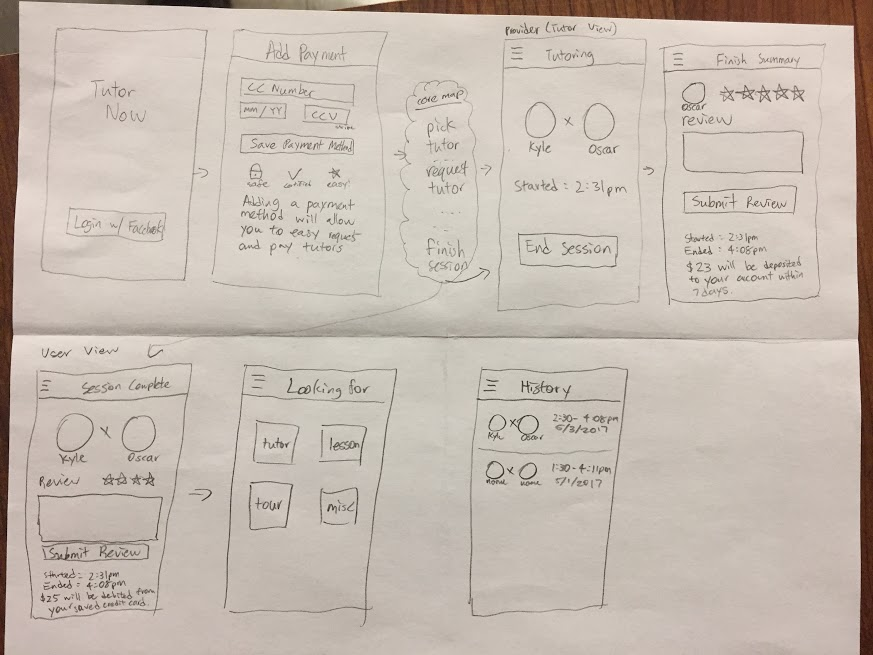

### David's Prototype

The descriptions are on paper, but if you can't see it, the first bank just shows the Profile page. The 2nd bank (labeled 2 on the bottom right corner) just simply shows the keyboard popping up when selecting the editable DISPLAY NAME box or the SKILLS box. The third image shows what happens when you click your profile photo. An action sheet pops up and lets you use the Device's PHOTO PICKER or CAMERA to update the profile photo. The 4th bank shows the proper editing control for the advertised hourly rate, using a number/price wheel instead of just a keyboard. The Banks labeled 5 show what happens when an user tries to save the profile. Form validation will validate the form, and show a popup depending on what happened. On Dismiss on a success, the view controller will pop back to the previous view on the viewcontroller stack.

### Maxim's Prototype

For my paper prototype2 I did one aspect of the app which was payment/summary for both the tutor and the student. So the tutor basically goes through the screens to decide how much to charge and can leave his review for the student and determing the rating for him. The student also confirms and agrees on the price and we utilize venmo/paypal's api to redirect to their application for payment and after payment, the student can click and submit their review for the tutor.

### Joey's Prototype

My paper prototype shows the process of switching your account from client to provider. The user is able to turn on and off their profile and manage their settings such as radius, schedule, payment method, and client ratings.

### Oscar's Prototype

For this prototype, I designed an alternate prototype where the user inputs in a credit card instead of doing venmo or paypal. This simplifies the interaction for the user as it is easier for them to end the session. They don't have to press a venmo button to end the session and the tutor is guaranteed to be paid. This is a way easier process for the user at the cost of having the transaction charges for credit cards being passed to the tutor.
