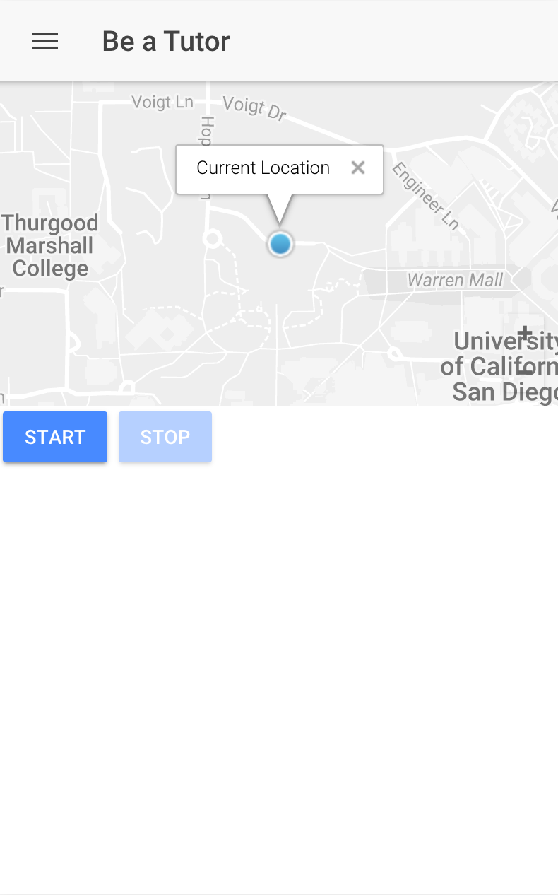
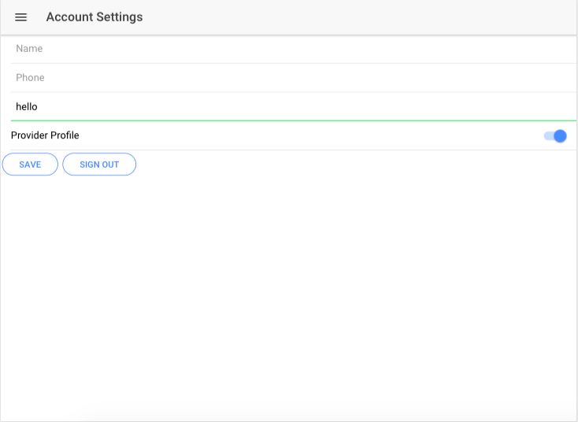

### Changes since last time

- Improve real time Geo Tracking - locations are now linked to the user ID and can be turned on/off
- Created more pages for core functionalities of app 

#### Rating Provider

#### Service In Progress Page

#### A Map of Your Current Location with infoWindow content

#### Account Settings Page

#### Provider Profile Page

#### Roles:
- Oscar Pan: Improved home page (map) to center on current location and created and styled list page. Also worked on the workflow of the app.
- David Zech: Improved real time Geo Tracking so locations are now linked to User ID and can be turned on/off.
- Max Chen:  Created in progress and provider profile pages and updated account settings, 
- Joey Wong: Created account settings and client request pages, and updated client summary page.

