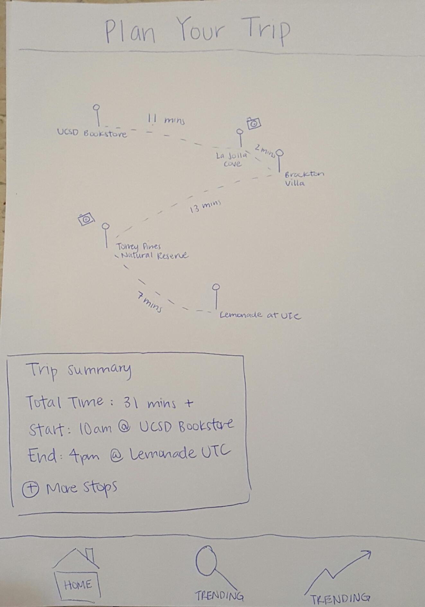
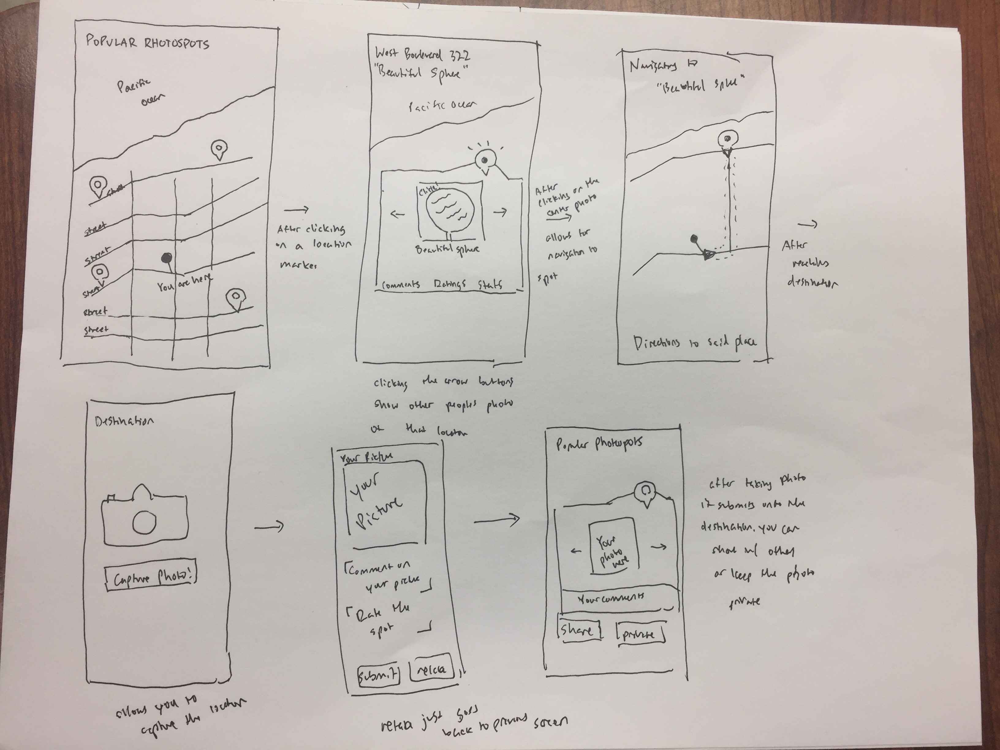
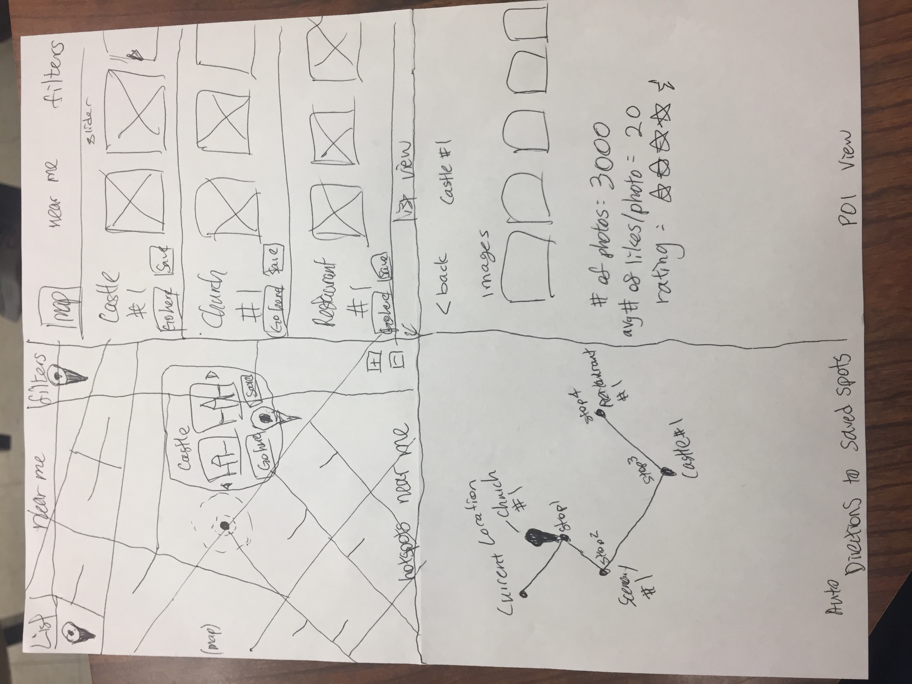
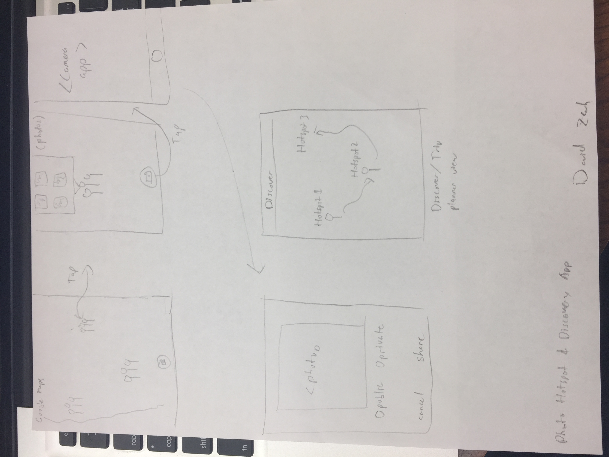
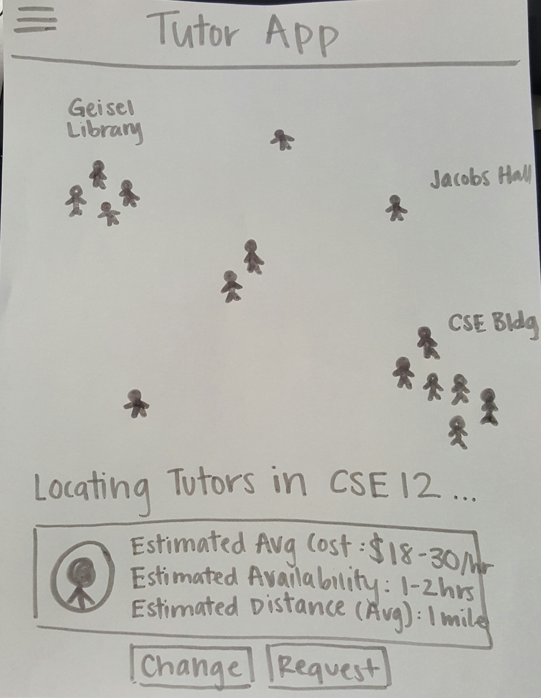
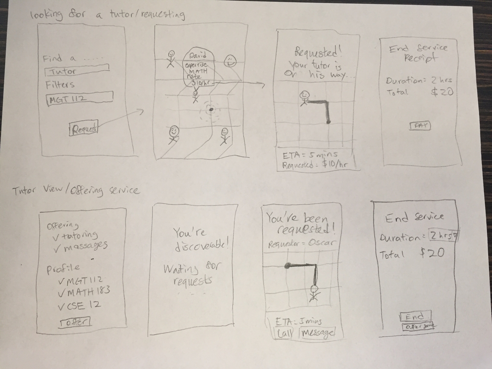

## Paper Prototypes

### Prototype 1 (Joey Wong)

This prototype lets users map out their day with photo hotspots and landmarks most efficiently. It would give you time estimates and directions from one point to another.

### Prototype 2 (Max Chen)

This paper prototype basically shows there pinned locations of popular photo spots. Given your location and after clicking that you want to go to that certain spot it will navigate you to the photo location where you can take pictures. Once you take pictures you can share your pictures publicly or privately. 

### Prototype 3 (Oscar Pan)

This prototype shows the list and map views of popular landmarks and photo spots. Both views allow you to quickly find places near you to save onto a route plan that is automatically generated for you based on closest/shortest path through all the saved places. There is also a view to checkout more pictures or details of the locations.

### Prototype 4 (David Zech)

This prototype shows heatmaps (hard to draw, drew pins instead) of popular places to take photos on the map. Clicking on an area will show you a little popover with a timeline of publicly shared photos

## Pivoted Idea to Tutoring Application

### Prototype 5 (Joey Wong)
\
This prototype shows a map of available tutors on campus after the user requested to look for CSE 12 tutors. The application also informs users of the average price, average availability, and average ETA of tutors. The user can request or modify their search and upon requesting, the user will be matched with a tutor based on location, price, and availability. User will be able to have a filter location, price range, availability.

### Prototype 6 (Oscar Pan)

This prototype shows both the view of the tutor and the user requesting the service. There is flexibility to expand the app into other services other than tutoring. The user is able to filter the tutors based on classes they're able to tutor for or subjects they're good at. The user is able to pick a tutor based on location, profile, and price.
