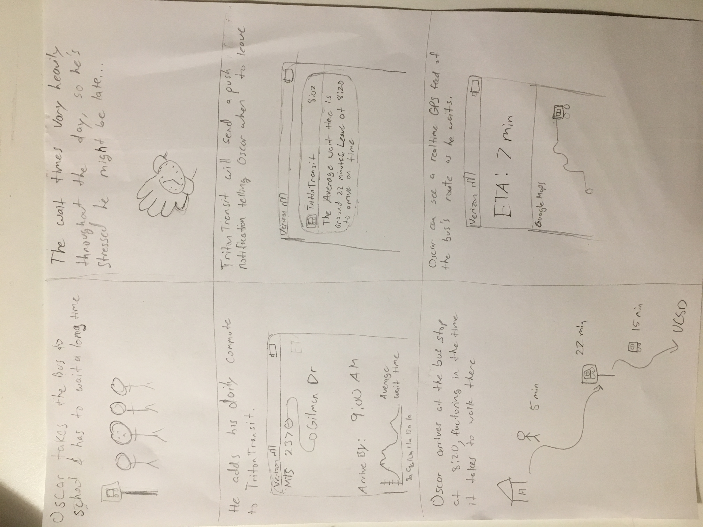
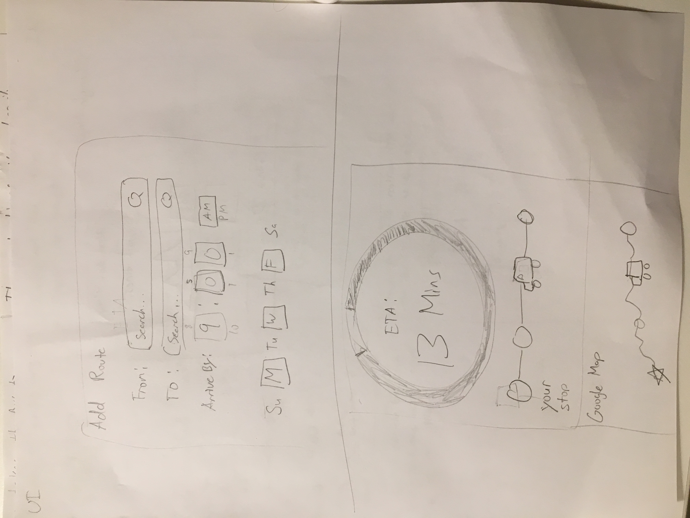

## Triton Transit Application
Our application allows UCSD students to get to school and around campus efficiently by providing ETAs and how crowded the buses/shuttles are.

### Idea Influences
From the feedback given to us from our classmates and TA, we felt this idea had the most potential, even though a similar application exists. What sets our application apart from the rest would be providing ETAs and accounting for how crowded the buses and shuttles are. Our application would be useful to UCSD students since a large percentage of the student body commute to school via MTS buses and there is currently no optimal application that makes commuting to school more time efficient.

### Our Roles
We will divide the project based on these tasks:  one member parses real time bus information from the GTFS API, another member draws the route maps given the polygon and works on push notifications, another member develops the user interfaces, and the last member calculates ETAs and develops an algorithm for that calculation. 

### Storyboard

### Features
Main features are a map showing you the routes provided by MTS and UCSD Shuttles. You can get a real time information of the buses on these routes, as well as graphical information displaying average wait times of each stop throughout the day. You will be able to setup recurring commute bookmarks that will send you a push notification telling you when to arrive at a bus stop, factoring in both wait time (for very long lines at the stop) as well as bus travel time. 

### UI mocks

